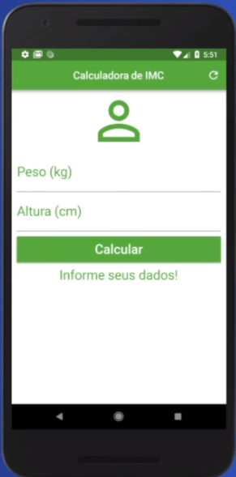
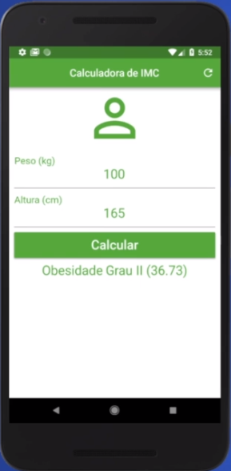

# Calculadora IMC
## Aplicativo simples voltado para a realização do cálculo IMC, com indicação da faixa de peso.

<h1 align="center">
  
</h1>

 <a href="#-sobre-o-projeto">Sobre</a> •
 <a href="#-layout">Layout</a> • 
 <a href="#-tecnologias">Tecnologias</a>

<h4 align="center"> 
	  Calculadora IMC ⚖️ Finalizado 
</h4>

## ⚖️ Sobre o projeto

Calculadora IMC foi um projeto desenvolvido, com fins didáticos, onde tinha como 
objetivo a criação de aplicativo simples em flutter utilizando conceitos básicos da ferramenta framework flutter e linguagem dart.

---

## ⚙Funcionalidades

-Basicamente o projeto consiste de apenas uma tela que possui dois campos inputs onde o usuário coloca suas informações que seria o peso e a altura em cm, 
em seguida aperta o botão calcular e um texto aparece logo abaixo indicando se o usuário está Abaixo do Peso, Peso Ideal, Levemente Acima do Peso, Obesidade Grau 1, Obesidade Grau 2
e Obesidade Grau 3:

  Tela de principal:
  
  <h1 align="center">
  	
  </h1>
  
  ---
  
  Tela de após calculo do IMC:
  <h1 align="center">
  	
  </h1>
  
  ---     

## 🎨Layout

O layout foi fornecido pela professor 
Daniel Ciolfi.

### 🛠Tecnologias

As seguintes ferramentas foram usadas na construção do projeto:

- [Flutter](https://flutter.dev/?gclsrc=aw.ds&gclid=EAIaIQobChMIjp3C8pSt9AIVrD6tBh3Y0ALjEAAYASAAEgL2hvD_BwE)
- [Dart](https://dart.dev/)
- [Android Studio](https://developer.android.com/studio?hl=pt&gclsrc=aw.ds&gclid=EAIaIQobChMImf6cj5Wt9AIVHR-tBh0uxQXrEAAYASAAEgI1IvD_BwE)
